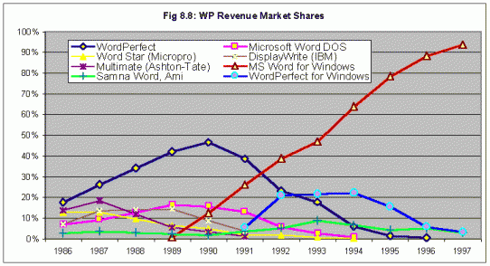
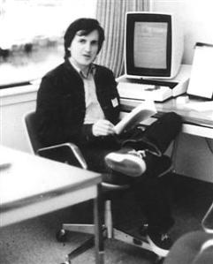
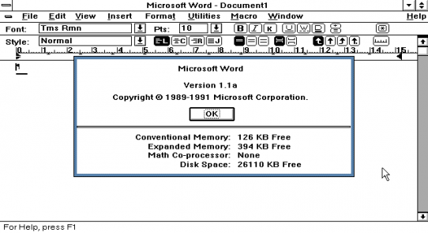

# Microsoft Word for Windows Version 1.1a Source Code

Original text from: [http://www.computerhistory.org/atchm/microsoft-word-for-windows-1-1a-source-code/](http://www.computerhistory.org/atchm/microsoft-word-for-windows-1-1a-source-code/)

## Software Gems: The Computer History Museum Historical Source Code Series

The dominant word processing program for personal computers in the 1980s was DOS-based WordPerfect. Microsoft Word for DOS, which had been released in 1983, was an also-ran.

That situation changed dramatically with the introduction of Microsoft Word for Windows in 1989.  By 1993 it was generating 50% of the word processing market revenue, and by 1997 it was up to 90%. [1]



Clearly there was something extraordinary about Word for Windows. Part of its success was due to Microsoft’s marketing acumen. But it was also a stunning technical achievement, and its ability to run on ordinary PCs created the first popular vanguard of the new graphics-oriented style of document preparation.

Remember, this was a time when a typical personal computer might have an 8 Mhz processor, 1 megabyte of memory, a 20 megabyte hard disk, and a floppy disk drive. How did Word accomplish so much with so little?

There’s only one way to understand the magic in detail: read the code. With the permission of Microsoft Corporation, the Computer History Museum is pleased to make available, for non-commercial use, the source code of Word for Windows version 1.1a as it was on January 10, 1991. This material is © Copyright by Microsoft.

The 7 MB zip file contains 1021 files in 33 folders. In the root directory there is a “readme” file that briefly explains the rest of the contents. Most of it is source code in C, but there are also text documents, x86 assembler-language source files, executable tools, batch files, and more.

To access this material you must agree to the terms of the license displayed here, which permits only non-commercial use and does not give you the right to license it to third parties by posting copies elsewhere on the web.

Download Microsoft Word for Windows Version 1.1a Source Code

Other historical source code releases in this series include IBM’s APL programming language, Apple II DOS, Adobe’s Photoshop, Apple Macpaint/QuickDraw, and Microsoft’s MSDOS.  If you would like us to do more of this, please consider supporting the museum’s efforts by making a donation. We are a 501(c)3 non-profit organization.

### How Microsoft Word Came To Be

In the dark ages of computer word processing, what you wrote (and saw on the screen, if you had one) was cryptic formatting commands embedded within the text, like this:

```
.nf
.ll 4.0i
.in 2.0i
101 Main Street
Morristown, NJ  07960
15 March, 1997
.sp 1i
.in 0
Dear Sir,
.fi
.ti 0.25i
I just wanted to drop you a note to thank you…
```
 

After “compiling” and printing, you finally saw the result – which often wasn’t what you wanted. Make changes. Try again.

The emergence of WYSIWYG (“What You See Is What You Get”) word processors changed all that. The screen showed what the final document would look like, and keyboard commands you used changed the look of the text, not a programming script.



_Charles Simonyi at Xerox PARC in 1980_

One of the first such programs was BRAVO, created in 1974 by Butler Lampson, Charles Simonyi and others at Xerox PARC, the Palo Alto Research Center, for the groundbreaking Alto computer. Simonyi later said,

 ”It was clear that quite a beautiful editor could be written for the Alto. Remember, the Alto had a black and white bitmap display. It had a mouse. It had an un-decoded keyboard. It had all the ingredients that are necessary for WYSIWYG. And, of course, then the network came around. The laser printer was coming alive. So all the components were there, except for the software…. We set out to write an editor and we finished it about three months.”[2]

Like much of the other innovative Alto software and hardware, BRAVO was never sold as a commercial product.

After nine years, Simonyi was frustrated by Xerox’s inability to turn great ideas into products. “I lost faith in Xerox’s ability to do anything”[3] . In 1981 he left and joined Microsoft to lead a team in creating application programs. The first, already in progress when he arrived, was the spreadsheet Multiplan, a VisiCalc competitor.

Simonyi was well-suited from his Xerox experience for the next assault on the competition: to unseat MicroPro’s popular WordStar word processor. He hired Richard Brodie, a brilliant programmer he had first hired in 1979 at PARC. The fact that Brodie had no college degree wasn’t an issue; Brodie said later that “He asked me some programming questions and he liked the way I answered them.”[4]

In the summer of 1982 Brodie began working with others at Microsoft on a word processor to be controlled by a mouse. It was finished just over a year later, in October 1983. “I had pretty much a free hand. It was a pretty small program, and I was familiar with word processing from my work at Xerox PARC with Charles.”[5]

It may have been a “small program” but it had some sophisticated features, including support for style sheets, multiple windows, footnotes, mail-merge, undo, and the proportional fonts that the newly emerging laser printers would be able to use. Microsoft founder and president Bill Gates was impressed. “One thing that just blew Bill away was an optimization of the display speed. We actually formatted as you typed. Every time you inserted one character, the screen would update to show exactly what was going to be printed.”[6]

Free demonstration copies of Microsoft Word for MS-DOS were bundled with the November 1983 issue of PC World magazine. But it received mixed reviews, in large part because it was so different from what most people were used to. The 1984 BYTE magazine review said it was “clever, put together well, and performs some extraordinary feats” but “extremely frustrating to learn and operate efficiently. …Word’s developers seem to be trying to completely reinvent word processing.”[7]

That is precisely what they were trying to do. Although it was inspired by the earlier work at Xerox, few people outside the research community had been yet exposed to the new regime that would eventually predominate. Microsoft Word brought WYSIWYG to the masses.

Over the next years Word was continually improved. The first version for Microsoft Windows was released in late 1989 at a single-user price of $495. It received a glowing review in Inforworld [8] that didn’t flinch at the price: “If your system is powerful enough to support Microsoft Windows, at $495 it is an excellent value.”



_Version 1.1a, whose source code we are making available here, was released the next year. Microsoft Word For Windows had started its remarkable climb to 90% market share._

### Acknowledgement

We are grateful to Roy Levin, Managing Director of Microsoft Research, Silicon Valley, for working hard to find the source code and getting permission for us to release it.

### References

[1] Stan Liebowitz and Stephen Margolis, “Winners, Losers, and Microsoft: Competition and Antitrust in High Technology”, Independent Institute, 2001

[2] Oral history interview of Charles Simonyi by Grady Booch, February 6, 2008, [http://www.computerhistory.org/collections/catalog/102702232](http://www.computerhistory.org/collections/catalog/102702232)

[3] Quoted in James Wallace and Jim Erikson,  “Hard Drive: Bill Gates and the Making of the Microsoft Empire”,  HarperBusiness 1992, p 219

[4] Quoted in Cheryl Tsang, “Microsoft; First Generation”, Wiley & Sons, 2000, p 52.

[5] Ibid, p. 57

[6] Ibid, p. 58

[7] Janet Cameron, “Word Processing Revisited”, BYTE Guide to the IBM PC, Fall 1984, p 171 <[Pages from 1984_09_BYTE](http://www.computerhistory.org/atchm/wp-content/uploads/2014/02/Pages-from-1984_09_BYTE.pdf)>

[8] ”Welcome Microsoft Word in A New Version for Windows”, by John Lombardi, Infoworld, January 15, 1990, pps. 78-80 <[Infoworld_1990-01-15_MicrosoftWordWindows10](http://www.computerhistory.org/atchm/wp-content/uploads/2014/02/Infoworld_1990-01-15_MicrosoftWordWindows10.pdf)>